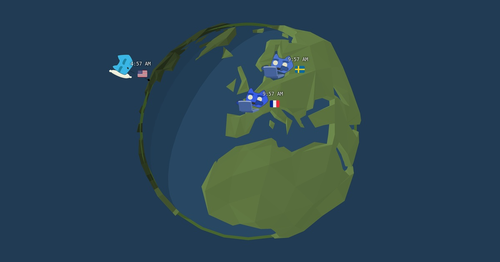

# Timezone.rock


> Visualize different timezones around the globe. Helps to plan meeting where everyone is awake.


## Screenshots



## Usage


**dev server**

```sh

# install dependencies
bun i

# start dev server
npm run dev
```

**trigger deployment**

```sh
# set the tag "live" to the current commit
git tag live -f ; git push --tags -f
```